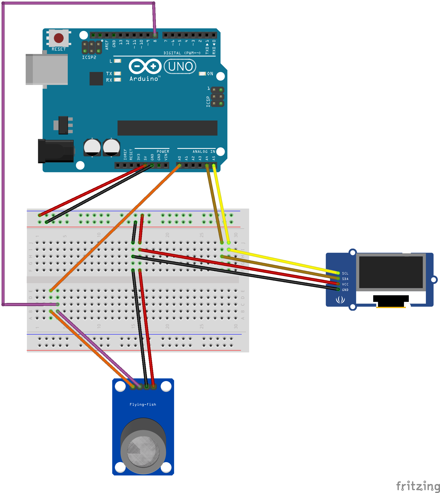

# Build your own H2S sensor using Arduino

This a simple setup that can be built using a microcontroller, sensor and a display. For my version I have used:
- [Arduino UNO SMD Rev3](https://www.amazon.com/gp/product/B007R9TUJE)
- [MCQ136](https://www.amazon.com/gp/product/B00S0CRNN2)
- [128x64 I2C OLED](https://www.amazon.com/gp/product/B00O2KDQBE)

This Arduino code allows the Arduino to receive data from MCQ136 at one second intervals and display it on the OLED.

The circuit layout used is shown below

